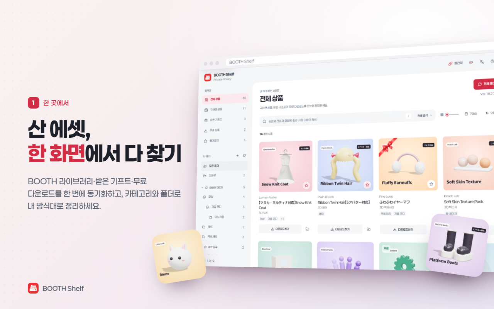
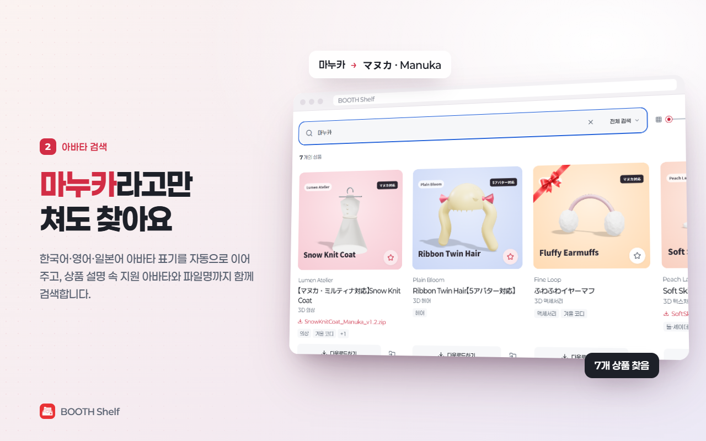
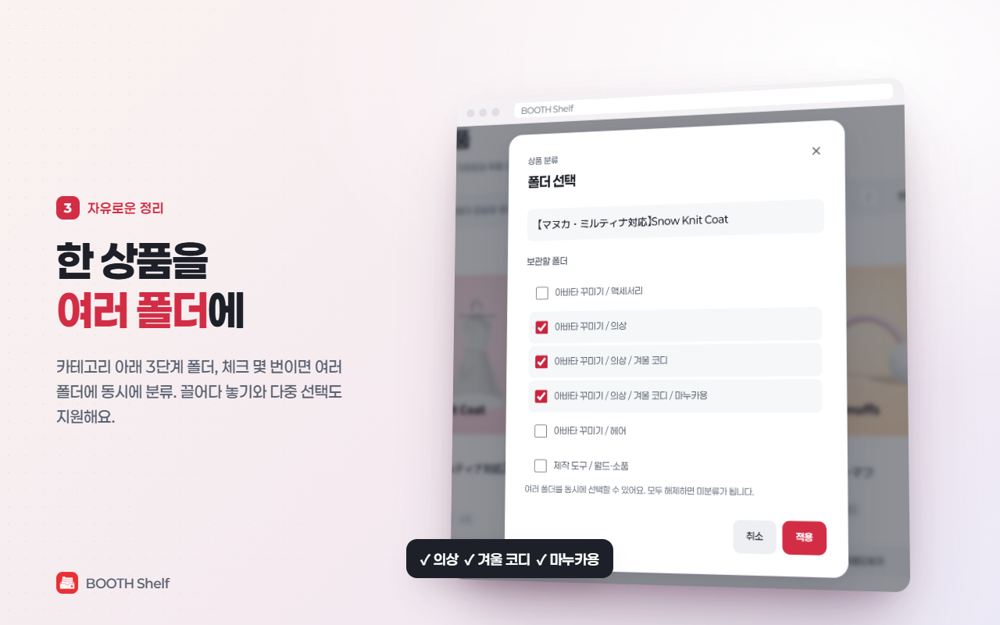
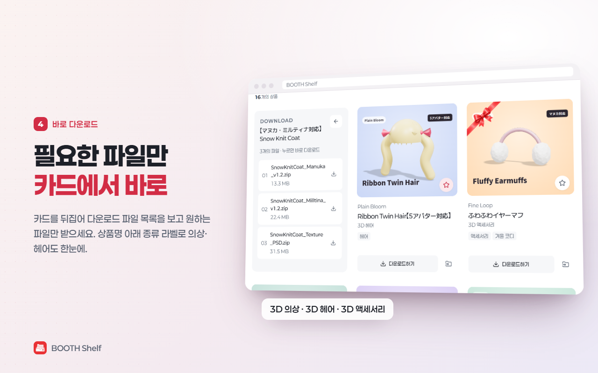
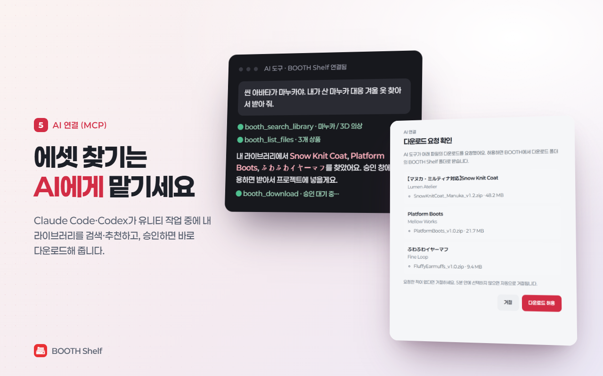

<div align="center">


# BOOTH Shelf

**BOOTH에서 산 에셋을 다시 찾는 가장 빠른 방법**

BOOTH의 내 라이브러리·받은 기프트·무료 다운로드를 한 화면에서 검색하고,<br>
즐겨찾기와 카테고리·3계층 폴더로 정리하는 Chromium 확장프로그램입니다.

[](https://chromewebstore.google.com/detail/aibjhdieagkjmcodaiopaklonjbdmbpj?utm_source=item-share-cb)
[](https://chromewebstore.google.com/detail/aibjhdieagkjmcodaiopaklonjbdmbpj?utm_source=item-share-cb)
[](https://github.com/KuroiineUshina/BOOTH-Shelf/releases/latest)
[](LICENSE)

### [▶ Chrome 웹 스토어에서 설치하기](https://chromewebstore.google.com/detail/aibjhdieagkjmcodaiopaklonjbdmbpj?utm_source=item-share-cb)

무료 · 오픈 소스 · 모든 데이터는 내 기기에만 저장

</div>

https://github.com/user-attachments/assets/f3fc61f1-6b18-4291-9339-c1505544dcab

## 미리 보기

| 한 화면에 모은 라이브러리 | 아바타 이름으로 검색 |
|:---:|:---:|
|  |  |
| **한 상품을 여러 폴더에** | **필요한 파일만 바로 다운로드** |
|  |  |
| **AI 연결 (MCP)** | |
|  | |

<sub>화면의 상점·상품은 기능 소개를 위한 가상 데이터입니다.</sub>

## 주요 기능

### 🔄 동기화
- 라이브러리·기프트·무료 다운로드 탭의 모든 페이지를 한 번에 동기화
- 같은 상품 페이지에서 보유한 여러 아바타 버전과 구매·기프트·무료 항목을 카드 하나로 통합

### 🔍 검색
- 상품명·판매자명·다운로드 파일명과 상품 설명의 지원 아바타로 검색
- 한 글자만 입력해도 부분 일치하는 한국어·영어·일본어 아바타 표기를 모두 연결하는 다국어 검색 (예: `마누카` → `マヌカ`·`Manuka`)
- 상품 설명의 지원 모델 구역과 연결된 원본 아바타 상품 링크를 분석해, 제목이나 파일명에 없는 지원 아바타도 검색
- 보유 파일명에서 아바타 전용 변형이 확인되면 해당 변형만 검색하고, 전용 표기가 없는 공용 파일에만 상품 설명의 지원 목록을 보조 검색 근거로 사용
- 상품명 아래에 BOOTH 상품 종류(3D 의상, 3D 헤어 등)를 표시하고, 종류 이름을 누르거나 검색창의 '종류' 범위로 같은 종류만 모아 보기
- 구매 상품·받은 기프트·무료 상품 필터와 즐겨찾기
- 위아래로 원통처럼 회전하는 구매순·이름순 기준 스위치와 오름차순·내림차순 방향 스위치

### 🗂️ 정리
- 접고 펼칠 수 있는 카테고리 아래에 최대 3계층 폴더를 구성하고 이름 변경·이동·삭제
- 상품 하나를 여러 폴더에 동시에 분류하고 카드에서 체크박스로 배치 관리
- 상품 카드를 사이드바 폴더로 끌어 놓아 기존 분류를 유지한 채 해당 폴더에도 추가
- 카드 클릭 다중 선택과 여러 상품 묶음 드래그
- 폴더마다 원하는 설명을 지정하고 백업·복원에 함께 보존
- 카드와 폴더 전용 우클릭 메뉴로 다운로드·상품 페이지·판매자 상점·폴더 관리를 바로 실행
- 카테고리·폴더·상품 배치·즐겨찾기를 JSON으로 백업하고 복원

### ⬇️ 다운로드와 이동
- 카드 플립으로 다운로드 파일 목록을 확인하고 선택한 파일 바로 다운로드
- 상품명 클릭으로 BOOTH 상품 상세 페이지, 판매자명 클릭으로 판매자 상점 열기

### 🤖 AI 연결 (MCP)
- Claude Code·Codex 같은 AI 도구가 내 라이브러리를 검색·추천하고, 허용한 파일을 다운로드 ([자세히](#-ai-연결-mcp-1))

### 🎨 화면과 편의
- 헤더의 언어 아이콘으로 한국어 → English → 日本語 UI 순환 전환
- 라이트·다크·시스템 테마 (시스템 모드는 운영체제 설정 변경을 자동 반영)
- 한 줄 4·5·6개 카드 배열과 드래그로 너비를 바꾸는 사이드바
- 목록 끝에 가까워지면 다음 상품을 자동으로 불러오는 무한 스크롤
- 헤더의 **빨간약** 버튼으로 결제가 확인된 주문의 실제 결제 금액 합계 확인
- 저장된 상품·즐겨찾기·카테고리·폴더 데이터를 앱 안에서 완전히 삭제
- 반응형 화면과 `prefers-reduced-motion` 접근성 설정 지원

<details>
<summary>세부 동작 더 보기</summary>

- 선택된 카드는 흔들림 없이 살짝 떠오르는 강조 효과를 사용합니다.
- 카드의 이미지·여백을 클릭해 여러 상품을 선택하거나 해제한 뒤, 어느 카드에서 드래그를 시작해도 선택한 카드 묶음만 한 번에 폴더로 옮깁니다.
- 드래그 묶음의 경계가 사이드 메뉴에 닿으면 75% 크기·75% 불투명도로 천천히 바뀌며, 개수 배지도 묶음과 함께 움직입니다.
- 폴더에 놓지 않은 드래그는 클릭 선택으로 처리하지 않습니다.
- 키보드·터치 환경을 위해 상품별 **폴더에 넣기 / 폴더 관리** 버튼을 제공합니다.
- 다운로드 옵션이 많으면 카드 안에서 파일 목록이 독립적으로 스크롤됩니다.
- 테마 버튼은 애니메이션 없이 즉시 전환되며 설정은 이 기기에 저장됩니다.
- 헤더에서 개발자의 Ko-fi 후원 페이지와 백업·복원·데이터 삭제 설정을 열 수 있습니다.

</details>

## 설치

### Chrome 웹 스토어 (권장)

1. [BOOTH Shelf Chrome 웹 스토어 페이지](https://chromewebstore.google.com/detail/aibjhdieagkjmcodaiopaklonjbdmbpj?utm_source=item-share-cb)를 열고 **Chrome에 추가**를 누릅니다.
2. 같은 브라우저 프로필로 [BOOTH 라이브러리](https://accounts.booth.pm/library)에 로그인합니다.
3. 도구 모음에서 **BOOTH Shelf**를 누르고 **전체 동기화**를 실행합니다.

웹 스토어 설치본은 새 버전이 승인·배포되면 브라우저가 자동으로 업데이트합니다. 확장 아이콘이 바로 보이지 않으면 브라우저의 확장프로그램 메뉴에서 BOOTH Shelf를 고정해 주세요.

<details>
<summary>GitHub Release로 직접 설치하기</summary>

1. [최신 GitHub Release](https://github.com/KuroiineUshina/BOOTH-Shelf/releases/latest)에서 `booth-shelf-vX.Y.Z.zip` 파일을 받습니다. GitHub가 자동으로 제공하는 **Source code** 파일이 아니라 이름이 `booth-shelf-`로 시작하는 설치 파일을 선택하세요.
2. ZIP을 계속 보관할 로컬 폴더에 압축 해제합니다.
3. Chrome 또는 Chromium 기반 브라우저에서 `chrome://extensions`를 엽니다.
4. 오른쪽 위의 **개발자 모드**를 켭니다.
5. **압축해제된 확장 프로그램을 로드합니다**를 누릅니다.
6. 압축 해제된 `booth-shelf` 폴더를 선택합니다.
7. 같은 브라우저 프로필로 [BOOTH 라이브러리](https://accounts.booth.pm/library)에 로그인합니다.
8. 도구 모음에서 **BOOTH Shelf**를 누르고 **전체 동기화**를 실행합니다.

압축해제 확장프로그램은 선택한 폴더의 JavaScript를 그대로 실행합니다. 설치 폴더를 삭제하거나 옮기면 확장프로그램이 더 이상 로드되지 않으므로 고정된 위치에 보관하세요. OneDrive 등 동기화 폴더를 사용할 때는 폴더를 다른 사람과 공유하지 말고 계정에 다단계 인증을 설정하세요.

**업데이트**: GitHub에서 설치한 압축해제 확장프로그램은 자동 업데이트되지 않습니다. 새 Release의 설치 ZIP을 받아 기존 설치 폴더의 파일을 교체한 뒤 `chrome://extensions`에서 BOOTH Shelf의 **새로고침** 버튼을 누르세요. 저장한 상품과 폴더는 브라우저의 확장 저장소에 있으므로 같은 확장 ID가 유지되는 한 그대로 남지만, 중요한 정리 정보는 업데이트 전에 별도로 확인하는 것을 권장합니다.

</details>

## 🤖 AI 연결 (MCP)

Claude Code·Codex 같은 AI 도구가 유니티 작업 중에 내가 산 에셋을 검색·추천하고, 내가 허용한 파일을 다운로드할 수 있습니다.

> 💬 "씬의 아바타에 맞는 내 의상 찾아서 받아 줘"

1. Node.js 18 이상을 설치합니다.
2. 터미널에서 연결 프로그램을 한 번 설치합니다. 관리자 권한은 필요 없습니다.
   ```bash
   npx booth-shelf-mcp install
   ```
   GitHub에서 받은 압축해제 설치본을 쓰면 BOOTH Shelf 설정에 표시되는 명령처럼 `--extension-id <확장 ID>`를 붙입니다.
3. Chrome을 다시 시작하고 BOOTH Shelf **설정 → AI 연결 (MCP) → AI 연결 켜기**를 누른 뒤 권한을 허용합니다.
4. 설치할 때 이 PC의 **Codex**(CLI·데스크톱 앱)와 **Claude Code**에 MCP 서버가 자동으로 등록됩니다. 새 세션을 열면 BOOTH 도구를 쓸 수 있습니다. 자동 등록을 원하지 않으면 `--no-register`를 붙이세요.

AI가 쓸 수 있는 도구는 라이브러리 검색, 상품의 파일 목록, 다운로드, 다운로드 상태 확인입니다.

- **다운로드는 기본적으로 요청마다 브라우저에 승인 창이 뜨며, 허용한 파일만** `다운로드/BOOTH Shelf/판매자/상품/`에 받습니다.
- 설정의 **다운로드할 때마다 승인 창 띄우기**를 끄면 묻지 않고 바로 받으며, 이때도 내 라이브러리의 BOOTH 파일만 한 번에 최대 30개까지 받습니다.
- AI에게는 상품명·판매자·종류·지원 아바타·파일명만 전달하고 다운로드 주소와 상품 설명 원문은 전달하지 않습니다.
- 연결 프로그램은 실행할 때마다 새로 만든 비밀 토큰이 있는 로컬 프로그램만 받아들입니다.

자세한 내용은 [mcp/README.md](mcp/README.md)를 확인하세요.

## 🔒 개인정보와 권한

별도 서버나 분석 도구가 없으며, 모든 데이터는 이 브라우저의 `chrome.storage.local`에만 저장됩니다.

| 권한 | 언제 | 용도 |
|---|---|---|
| `storage` | 항상 | 검색용 상품 정보와 즐겨찾기·카테고리·폴더 구성을 이 기기에 저장 |
| `unlimitedStorage` | 항상 | 상품이 많은 라이브러리도 기본 10MB 제한에 걸리지 않도록 로컬 저장 용량 제한 해제. 새로 읽거나 전송하는 데이터 없음 |
| `https://accounts.booth.pm/*` | **전체 동기화**·**빨간약** 첫 실행 시 요청 | 로그인된 사용자의 라이브러리·기프트·무료 다운로드 페이지와, **빨간약** 실행 시 구매 내역의 결제 금액 읽기 |
| `https://booth.pm/*` | **전체 동기화** 첫 실행 시 요청 | 보유 상품의 공개 상품 설명과 연결된 상품 링크를 읽어 지원 아바타 찾기. 로그인 정보는 보내지 않음 |
| `nativeMessaging`·`downloads`·`offscreen` | **AI 연결**을 켤 때만 요청 | 이 PC의 연결 프로그램과 통신, 승인한 BOOTH 파일 다운로드, 다운로드 파일 목록이 있는 라이브러리 페이지 분석. AI 연결을 끄면 함께 해제 |

<details>
<summary>저장하는 정보와 보안 자세히 보기</summary>

저장하는 정보는 상품 ID, 상품명, 판매자명, 썸네일 URL, 상품 URL, 라이브러리/기프트/무료 다운로드 페이지 위치, 다운로드 파일명·표시 용량, 상품 설명에서 감지한 지원 아바타 ID와 확인 시각, 즐겨찾기, 카테고리·폴더 구성과 설명, 테마·언어·카드 배열·사이드바 너비 설정입니다. 상품 설명 원문은 저장하지 않습니다. 다운로드 파일명과 지원 아바타 ID는 로컬 검색에만 사용합니다.

**빨간약** 결과는 통화별 합계·결제 확인 주문 수·무료 주문 수·계산 시각만 이 기기에 캐시하며 주문번호와 개별 주문 내용은 저장하지 않습니다. 쿠키도 읽거나 저장하지 않습니다.

실제 다운로드 URL은 사용자가 **다운로드하기**를 열 때 BOOTH 페이지에서 다시 읽어 현재 화면의 메모리에만 잠시 유지하며 `chrome.storage.local`에는 저장하지 않습니다. 선택한 URL은 BOOTH 자체 버튼과 같은 현재 페이지 다운로드 방식으로 BOOTH에만 전달되며, 별도의 다운로드 기록 접근 권한은 사용하지 않습니다.

브라우저 기록 삭제만으로는 확장 저장소가 삭제되지 않으므로 헤더의 **설정 → 저장 데이터 모두 삭제**를 사용하세요. 이 버튼은 저장값과 함께 BOOTH 계정·상품 페이지 읽기 권한도 해제합니다.

저장 데이터와 링크는 로드할 때마다 스키마를 검사하며, 계정 페이지·상품·판매자·썸네일은 허용된 BOOTH 주소만 사용합니다. 명시적 콘텐츠 보안 정책(CSP)이 원격 코드, 임의 연결, 프레임과 객체 삽입을 차단합니다.

</details>

자세한 내용은 [개인정보 처리 안내](PRIVACY.md)를 확인하세요. 보안 취약점은 공개 Issue에 세부 내용을 올리지 말고 [보안 정책](SECURITY.md)의 절차로 알려주세요.

## ⚙️ 데이터 동작

<details>
<summary>정렬·폴더·동기화·빨간약이 어떻게 동작하는지 보기</summary>

- **구매순 오름차순**은 BOOTH 라이브러리에 표시된 페이지와 카드 순서를 그대로 사용하며, 내림차순은 이를 반대로 표시합니다.
- 정렬 기준 버튼은 구매순과 이름순을, 정렬 방향 버튼은 오름차순과 내림차순을 전환합니다. 정렬은 항상 두 버튼에 표시된 한 가지 조합으로 적용됩니다.
- 카테고리는 폴더 3계층 제한에 포함되지 않습니다. 카테고리를 삭제하면 안의 최상위 폴더는 삭제되지 않고 **카테고리 없음**으로 이동합니다.
- 다시 동기화하면 상품 목록은 최신 상태로 교체되고, 남아 있는 상품의 즐겨찾기와 모든 카테고리·폴더 배치는 유지됩니다.
- 카드를 폴더에 드래그하면 기존 배치를 바꾸지 않고 새 폴더를 추가합니다. **미분류**에 놓으면 해당 상품의 모든 폴더 배치를 해제합니다.
- 폴더를 삭제하면 하위 폴더와 그 폴더에 넣은 배치만 한 단계 위로 옮겨지며, 같은 상품의 다른 폴더 배치는 그대로 유지됩니다. 최상위 폴더를 삭제하면 그 폴더 배치만 해제됩니다.
- 1.0.5 이하의 단일 폴더 배치 데이터와 백업 파일은 처음 로드할 때 다중 폴더 형식으로 자동 변환됩니다.
- BOOTH의 화면 구조가 바뀌거나 점검 화면이 반환되면 동기화를 중단합니다. 구매·기프트·무료 다운로드 목록을 모두 확인한 뒤 상품 목록을 저장하며, 목록 확인에 실패하면 기존 목록과 정리 데이터를 유지합니다.
- 전체 동기화는 구매·기프트·무료 다운로드 목록, 다운로드 파일명·표시 용량, 공개 상품 설명의 지원 모델 구역과 원본 아바타 상품 링크를 읽어 로컬 검색 색인에 저장합니다. 상품 설명 원문과 링크 목록은 저장하지 않으며, 파악한 지원 아바타 ID만 저장합니다. 상품 목록 저장이 끝나면 바로 사용할 수 있고, 지원 아바타 확인은 그 뒤에 백그라운드에서 이어집니다. 상품 설명은 HTML 페이지 대신 BOOTH의 가벼운 공개 상품 JSON(`/items/<ID>.json`)으로 읽습니다. 설명 색인은 상품마다 30~45일 동안 재사용하고 중간 저장하므로, 다음 동기화에서 이미 확인한 상품을 반복 요청하지 않고 재확인도 한꺼번에 몰리지 않습니다.
- 설명을 읽지 못한 상품은 기존 지원 정보를 유지하고 다음 동기화에서 다시 확인합니다. 설명 분석 방식이 변경된 버전에서는 이전 색인도 다시 확인합니다.
- 카드의 **다운로드하기**를 열면 최신 라이브러리 페이지에서 실제 다운로드 URL을 다시 읽습니다. URL은 저장하지 않으며 화면을 닫으면 사라집니다. 상품 위치가 바뀌어 목록을 찾지 못하면 전체 동기화 후 다시 시도해 주세요.
- 빨간약은 구매 내역에서 결제가 확인된 주문(`paid`·`completed`·배송 완료 상태)을 중복 제거한 뒤 주문 상세의 `결제 금액` 항목을 합산합니다. 미결제·취소·환불 주문은 제외하며 BOOST와 배송비 등이 포함될 수 있고, 받은 기프트는 제외됩니다. 서버 부하를 줄이기 위해 결과를 로컬에 캐시하고 사용자가 **다시 계산**을 누를 때만 갱신합니다.
- 여러 창의 즐겨찾기·폴더·설정 변경은 최신 저장값을 기준으로 순서대로 반영합니다. 저장에 실패하면 성공으로 표시하지 않습니다.
- 여러 창에서 동기화·빨간약 계산·백업 복원·데이터 삭제가 겹치면 나중에 시작한 작업을 중단하고 다시 시도하도록 안내합니다. 빨간약 계산은 요약 저장이 끝날 때까지 다른 작업과 겹치지 않습니다.
- 정리 데이터 백업은 최대 32MiB이며, 내보내기와 가져오기에 같은 크기 제한을 적용합니다. 제한을 넘는 경우 복원할 수 없는 파일을 만들지 않고 오류를 안내합니다.
- 요청 시작 간격은 최소 300ms를 유지합니다. 동기화는 최대 4개, 다운로드 옵션·결제 통계 조회는 최대 2개씩 병렬 처리하고 일시적인 BOOTH 오류와 요청 제한 응답에 재시도 대기를 적용합니다.
- 상품 설명은 중간 저장 때문에 요청을 멈추지 않고 연속 처리합니다. 저장은 한 번에 하나씩 진행하고 최종 저장이 끝난 뒤 완료로 표시합니다. 같은 동기화 안에서 보유 상품과 아바타 링크가 같은 상품을 가리키면 조회·분석 결과를 공유합니다.

</details>

BOOTH의 공식 안내에 따르면 받은 선물은 라이브러리의 [기프트 탭](https://accounts.booth.pm/library/gifts)에서 확인할 수 있습니다. 또한 [BOOTH 가이드라인](https://booth.pm/guidelines)에 따라 서버에 과도한 부하를 주지 않는 범위에서 사용해야 합니다. 이 프로젝트는 pixiv 또는 BOOTH의 공식 제품이 아닌 비공식 로컬 도구입니다.

## ☕ 후원

개발자를 응원하고 싶다면 앱 헤더의 Ko-fi 컵 아이콘이나 [Ko-fi 후원 페이지](https://ko-fi.com/kuroiineushina)를 이용해 주세요. 링크는 새 탭으로 열리며, 결제 및 개인정보 처리는 Ko-fi에서 이루어집니다. 후원 여부와 관계없이 모든 기능은 동일하게 제공됩니다.

## 🛠️ 개발

현재 개발 버전은 **1.0.12**입니다. Manifest의 기술 버전과 사용자에게 표시되는 버전을 동일하게 관리합니다.

추가 패키지 설치 없이 Node.js 내장 테스트를 실행할 수 있습니다.

```powershell
npm test
npm run check
npm run verify:version
```

UI 미리보기는 정적 서버에서 `dashboard.html?demo=1`을 열면 실제 계정 데이터 없이 확인할 수 있습니다. 데모의 정리·설정·계산·삭제는 해당 화면의 메모리에만 적용되며 확장프로그램의 실제 저장소와 분리됩니다.

## 📄 라이선스

[MIT License](LICENSE)로 배포됩니다. BOOTH 및 pixiv의 명칭과 서비스는 각 권리자에게 있으며, 이 프로젝트는 BOOTH 또는 pixiv의 공식 제품이 아닙니다.

- UI 아이콘: [Lucide Icons](https://lucide.dev/) (ISC 라이선스, 전문은 [`assets/lucide/LICENSE`](assets/lucide/LICENSE))
- 글꼴: 한국어·영어 UI에는 [Paperlogy](https://freesentation.blog/paperlogyfont), 일본어 UI에는 [M PLUS 1](https://mplusfonts.github.io/)을 사용합니다. Paperlogy의 영문은 Montserrat를 기반으로 하며, 두 서체는 확장프로그램 내부에 포함되어 원격 글꼴을 내려받지 않습니다. 두 서체 모두 SIL Open Font License 1.1에 따라 배포되며 라이선스 전문과 출처는 [`assets/paperlogy`](assets/paperlogy)와 [`assets/m-plus-1`](assets/m-plus-1)에서 확인할 수 있습니다.
- 후원 메뉴: [Ko-fi 공식 브랜드 에셋](https://more.ko-fi.com/brand-assets)의 컵 아이콘을 사용합니다. Ko-fi 명칭과 로고는 Ko-fi의 권리자에게 있습니다.
